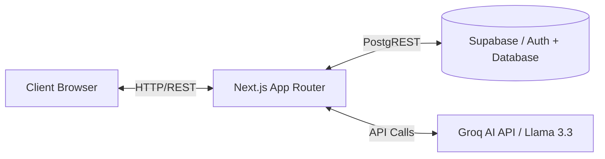
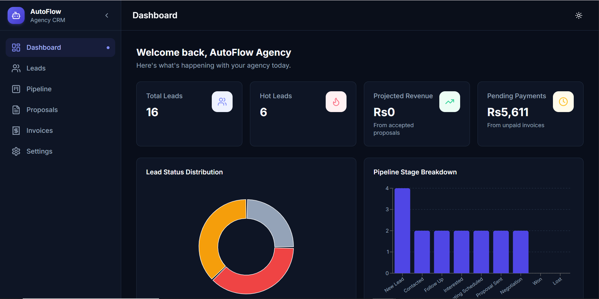
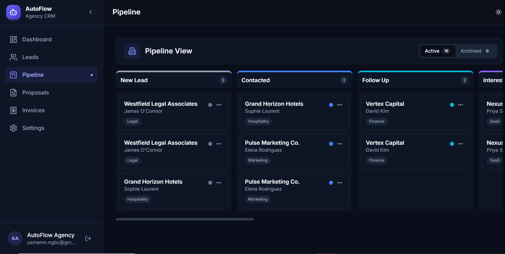
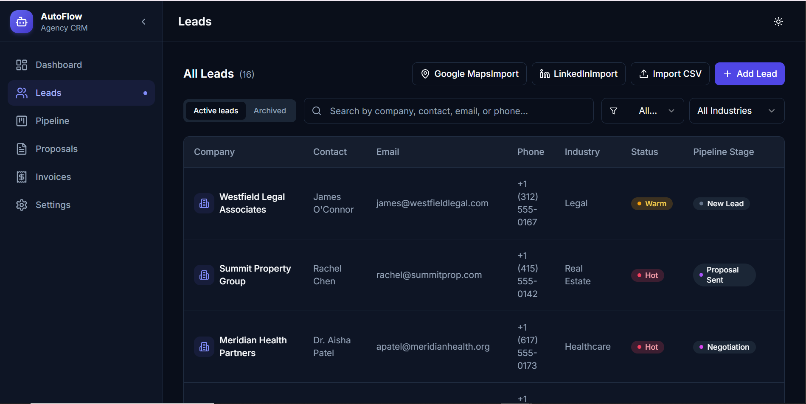
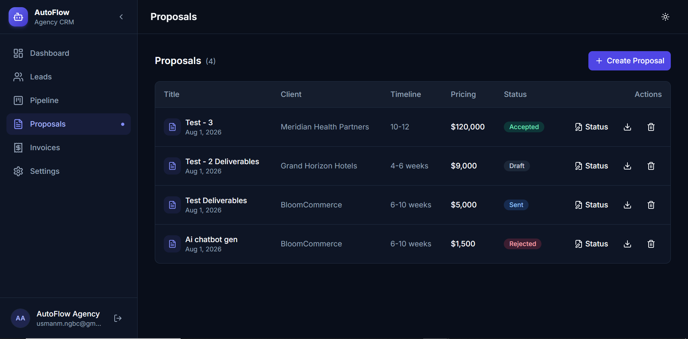

<div align="center">
  <h1>AutoFlow Agency CRM</h1>
  <p><b>AI-powered CRM for automation agencies</b></p>
  <p>
    
    
    
    
    
    
  </p>
</div>

---

## ✨ Features

- [x] **Lead Management with Kanban Pipeline**: Effortlessly track leads through customizable stages.
- [x] **AI Lead Analysis (Groq-powered)**: Automatically parse incoming lead data to gauge sentiment, urgency, and budget.
- [x] **AI Outreach Generator**: Draft high-converting cold emails and LinkedIn messages contextualized for each lead.
- [x] **Proposal & Invoice PDF Generation**: Instantly generate professional, branded documents directly from the dashboard.
- [x] **CSV Import**: Bulk import prospects seamlessly.
- [x] **Real-time Sync**: Keep team members on the same page with instant database updates.
- [x] **Dark Mode**: Beautiful, accessible interface that's easy on the eyes.

## 🛠 Tech Stack

| Layer | Technology |
| --- | --- |
| **Framework** | Next.js 13 (App Router) |
| **Language** | TypeScript |
| **Database** | Supabase (PostgreSQL + RLS) |
| **AI** | Groq API (Llama 3.3) |
| **UI** | shadcn/ui + Tailwind CSS |
| **State** | Zustand |
| **PDF** | jsPDF |

## 🏗 Architecture Diagram



## 🚀 Installation Guide

### Prerequisites
- Node.js 18+
- Supabase account (local or cloud)
- Groq API Key

### Step-by-Step Setup

1. **Clone the repository**
   ```bash
   git clone https://github.com/aliusmanm1122/autoflow-agency-crm.git
   cd autoflow-agency-crm
   ```

2. **Install dependencies**
   ```bash
   npm install
   ```

3. **Configure Environment Variables**
   Create a `.env.local` file based on `.env.example`:
   ```bash
   cp .env.example .env.local
   ```
   Add your keys:
   ```env
   NEXT_PUBLIC_SUPABASE_URL=your_supabase_url
   NEXT_PUBLIC_SUPABASE_ANON_KEY=your_supabase_anon_key
   GROQ_API_KEY=your_groq_api_key
   ENCRYPTION_SECRET=your_32_char_secret_here

   ```

4. **Run the development server**
   ```bash
   npm run dev
   ```
   Visit `http://localhost:3000` to see the application.

## 📸 Screenshots


_Dashboard overview with key metrics and recent activity._


_Drag-and-drop lead management pipeline._


_Automated insights and outreach generation._


_Generate branded proposals and invoices as PDF documents._

## 🗄 Database Setup

This project uses Supabase as a backend. You will need to apply the provided database migrations to set up your schema and tables. 

**Row Level Security (RLS)** is enforced on all tables. Please ensure your RLS policies are applied correctly in the Supabase dashboard to secure your tenant data. Refer to the migrations directory for the specific SQL policies used.

## 🤝 Contributing

Contributions are always welcome. Please follow the standard GitHub flow:
1. Fork the project
2. Create your feature branch (`git checkout -b feature/AmazingFeature`)
3. Commit your changes
4. Push to the branch
5. Open a Pull Request

## 📄 License

This project is licensed under the MIT License - see the [LICENSE](LICENSE) file for details.
